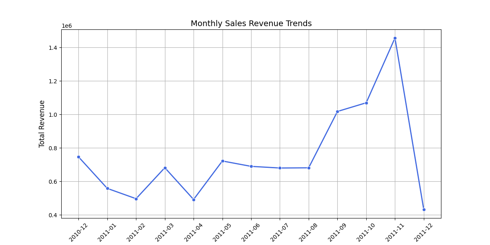
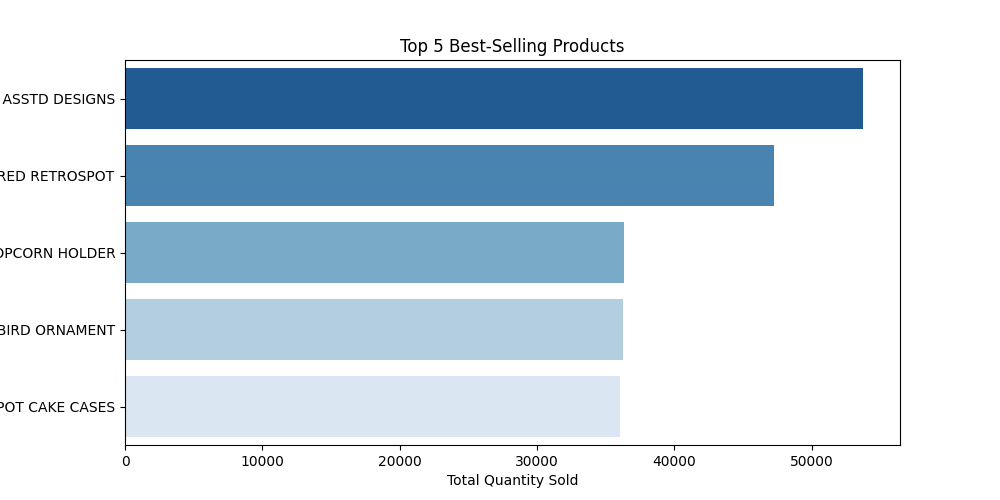
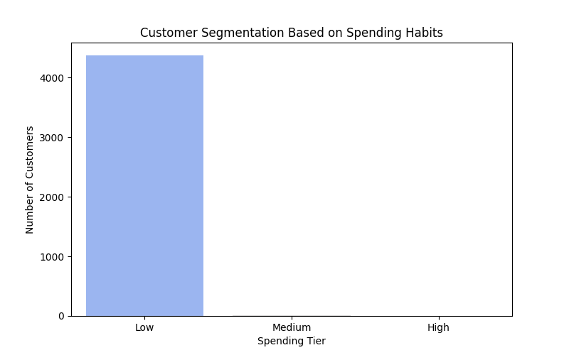
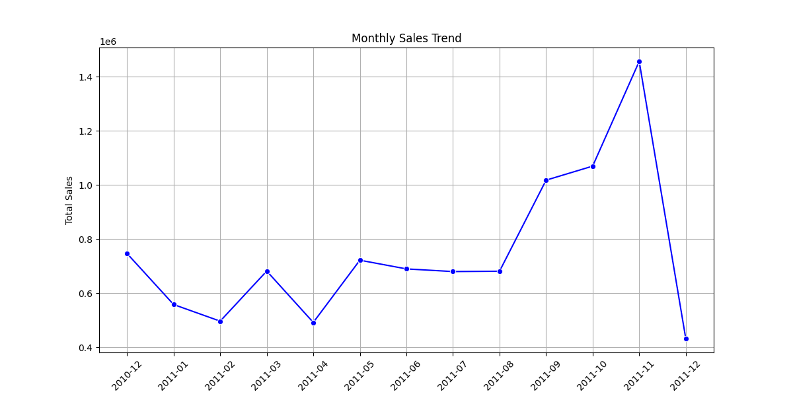
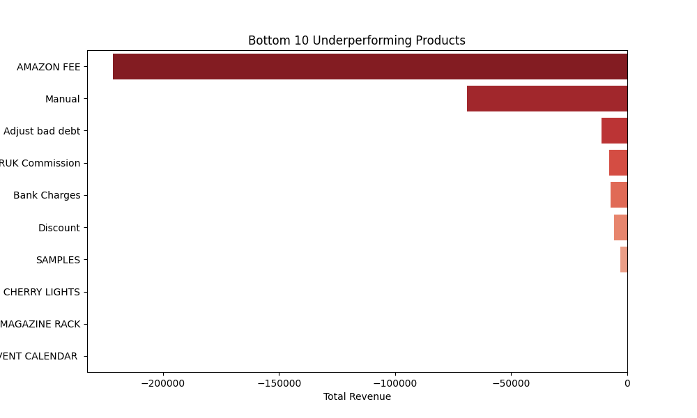

# E-commerce Sales Data Analysis: Trends, Customer Segmentation, and Insights

## 📌 1. Project Description

- This project explores and analyses E-commerce sales data to extract valuable business insights. It focuses on:

- **Monthly Sales Revenue Trends** – Understanding sales fluctuations over time  
- **Top 5 Best-Selling Products** – Identifying the most popular items  
- **Customer Segmentation** – Categorizing customers based on spending behaviour  
- **Actionable Insights & Recommendations** – Discovering seasonal trends and underperforming products to optimize business strategies

The analysis is conducted using Python, leveraging libraries like Pandas, Seaborn, Matplotlib, and Scikit-learn for data processing, visualization, and machine learning-based segmentation.

## 📂 2. Dataset Overview

The dataset contains E-commerce transaction records, including details such as:

- Invoice details (Invoice number, Date, and Customer ID)  
- Product details (Stock Code, Description, Quantity, and Unit Price)  
- Customer-related data (Customer ID and spending behavior)  

### 🔹 Key Columns in the Dataset:

| Column Name | Description |
|-------------|-------------|
| InvoiceNo   | Unique identifier for each transaction |
| StockCode   | Unique product code |
| Description | Product name or description |
| Quantity    | Number of units purchased |
| InvoiceDate | Date and time of purchase |


## 🛠️ 3. Technologies Used  
- **Python**  
- **Pandas, NumPy** – Data Processing  
- **Scikit-Learn** – Machine Learning  
- **Matplotlib, Seaborn** – Data Visualization


## 🚀 4. How to Run  
1. **Clone the repository**:  
   ```bash
   git clone https://github.com/AmirhosseinGhalaei/Fraud-Prediction-Using-Machine-Learning.git

2. **Create the project directory**:  
   ```bash
   mkdir Fraud-Prediction-Using-Machine-Learning

3. **Navigate to the directory**:
   ```bash
   cd Fraud-Prediction-Using-Machine-Learning

4. **Install required libraries**:
   ```bash
   pip install pandas numpy scikit-learn imbalanced-learn matplotlib seaborn

5. **Run the Python script**:
   ```bash
    python FraudPrediction.py


## ⚙️ 5. Methodology & Approach

This project follows a structured data analysis pipeline to extract insights from the E-commerce transaction dataset. The methodology consists of the following key steps:

### 🔹 5.1 Data Exploration & Cleaning

Before performing any analysis, we ensured that the dataset was clean and structured by:

➖ Handling missing values (e.g., filling missing Description based on StockCode, assigning default CustomerID where missing).  
➖ Removing duplicates to prevent over-counting transactions.  
➖ Converting data types, particularly InvoiceDate, to datetime format for accurate time-based analysis.

### 🔹 5.2 Monthly Sales Revenue Trends

To understand revenue fluctuations, we:

➖ Visualized the sales trend using a line chart.  
➖ Extracted Year and Month from InvoiceDate.  
➖ Calculated monthly revenue by summing (Quantity × UnitPrice).

### 🔹 5.3 Identifying Top 5 Best-Selling Products

To determine which products were the most popular, we:

➖ Visualized them using a bar chart.  
➖ Grouped data by Description and calculated total quantity sold.  
➖ Identified the top 5 best-selling products based on sales volume.

### 🔹 5.4 Customer Segmentation (Based on Spending Habits)

To classify customers into meaningful categories, we:

➖ Visualized the segmentation using a bar chart.  
➖ Assigned labels to customer groups based on spending distribution.  
➖ Computed Total Spending per Customer (Quantity × UnitPrice).  
➖ Applied K-Means Clustering to group customers into Low, Medium, and High spending tiers.

### 🔹 5.5 Actionable Insights & Recommendations

To provide valuable business recommendations, we:

➖ Suggested strategies for marketing, inventory management, and pricing optimization.  
➖ Identified seasonal trends in sales.  
➖ Found underperforming products that generated the least revenue.

## 📈 6. Data Visualization & Insights

### ✅ 6.1 Monthly Sales Revenue Trends

**Figure 6.1: Monthly Sales Revenue Trends**




This line chart represents the total revenue generated over a period of time, segmented by month.

The x-axis displays the months, while the y-axis represents total revenue in dollars.

The trend shows fluctuations, with some months having lower sales and a sharp increase toward the end of the period.

A significant peak is observed in November, followed by a sharp decline in December, possibly indicating a seasonal effect or an end-of-year sales boost.

### ✅ 6.2 Top 5 Best-Selling Products

**Figure 6.2: Top 5 Best-Selling Products**



This horizontal bar chart visualizes the top 5 best-selling products based on the total quantity sold.

The products are ranked from highest to lowest sales, with the highest-selling product at the top.

The length of each bar represents the total number of units sold, providing an easy way to compare the most popular items.

This insight can be used for inventory management, marketing strategies, and restocking decisions.

### ✅ 6.3 Customer Segmentation Based on Spending Habits

**Figure 6.3: Customer Segmentation Based on Spending Habits**



This bar chart categorizes customers into Low, Medium, and High spending tiers based on their purchase behaviour.

The y-axis represents the number of customers, while the x-axis represents the spending tiers.

The data indicates that the majority of customers fall into the Low spending tier, with very few or no customers in the Medium and High tiers.

This suggests a price-sensitive customer base, highlighting the need for targeted promotions to encourage higher spending.

### ✅ 6.4 Monthly Sales Trend

**Figure 6.4: Monthly Sales Trend**



This visualization is similar to Figure 4.1, showing monthly sales trends over time using a line chart.

It tracks total sales revenue over different months, illustrating sales performance patterns.

The pattern is nearly identical to the one in Figure 4.1, indicating consistent sales fluctuations, seasonal variations, or business cycles.

### ✅ 6.5 Bottom 10 Underperforming Products



**Figure 6.5: Bottom 10 Underperforming Products**

This horizontal bar chart highlights the worst-performing products in terms of total revenue.

The x-axis represents negative revenue values, meaning these products resulted in losses or low sales.

The topmost bar (largest negative value) represents the biggest underperformer, possibly due to high returns, low demand, or high costs.

Categories like "AMAZON FEE" and "Manual" suggest operational expenses rather than physical products, which could indicate costs deducted from revenue.


## 📜 License
- This project is licensed under the MIT License.

## ✉️ Contact

- **GitHub Profile:** https://github.com/AmirhosseinGhalaei
- **Email:** amirhosseinghalaei@outlook.com


